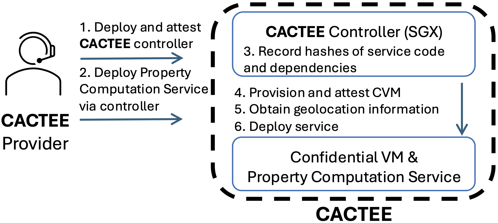
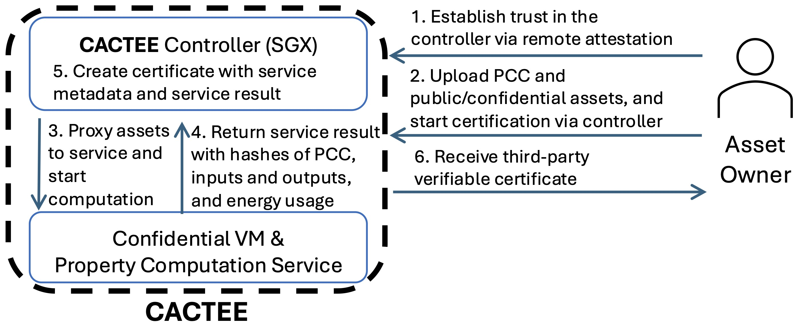
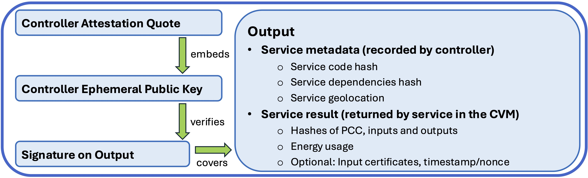

# CACTEE: Confidential Asset Certification using Trusted Execution Environments

This repository contains the software artifacts published as part of the artifact evaluation for the paper titled:

CACTEE: Confidential Asset Certification using Trusted Execution Environments

The paper appears at the Proceedings of the [9th Workshop on System Software for Trusted Execution (SysTEX 2026)](https://systex-workshop.github.io/2026/) happening on April 27, 2026 in co-location with [EuroSys 2026](https://2026.eurosys.org) April 27-30, 2026, Edinburgh, Scotland.

## About
**Confidential Asset Certification** enables owners of digital assets (e.g., ML datasets/models, software) to prove properties about their assets to third parties without disclosing said assets to anyone.

Examples of such properties include but are not limited to ML datasets having appropriate statistical properties, relevant features and satisfactory measures taken for privacy, 
ML models possessing satisfactory performance and matching lineage for used training datasets 
as well as the build environments for software binaries whose source-code may not always be available or reproduction is resource-heavy and time-consuming.

By utilizing Trusted Execution Environments (TEEs), 
we obtain proofs about the properties of different types of confidential assets
(e.g., datasets, models, software).
These proofs are third-party verifiable.
The third parties could be potential buyers in a marketplace, fellow participants in a collaborative ML training session, downloaders of software binaries and/or auditors or regulators.
As such, they improve the satisfaction of company policies and compliancy requirements regarding privacy and security.
The proofs are also self-contained, so that no additional infrastructure is needed than what already exists today.

These proofs can be seen as complementary and enhancements to existing efforts in improving automation and security while sharing code, such as Software Bill of Materials (SBoMs) or Machine Learning Bill of Materials (MLBoMs). These efforts usually focus on increasing accountability by creating a provenance trail of the assets being used, whereas our approach enables checking of properties for confidential assets before use (i.e., audit-after vs verify-before).

## Deployment

The Asset Certification Service (CACTEE) can be deployed on Azure via the [deployment instructions](deployment.md).

### Service Provider Workflow (Figure 1)

This figure shows the high-level steps of deploying CACTEE as the service provider, detailed in the [deployment instructions for the service provider](deployment.md#service-provider-setup).

### Asset Owner Workflow (Figure 2)

This figure shows the high-level steps of getting a confidential asset certified via CACTEE, detailed in the [certifications instructions for the asset owners](deployment.md#asset-owner-setup).

### Certificate Content (Figure 3)

This figure shows how the trust-of-chain for a property is established:
The TEE quote of the controller embeds its public key. 
The public key verifies the signature of the controller on the output.
The output contains the service metadata and the service result.
The service result's outputs describe the property in question.
In addition, the geolocation in the service metadata and the energy usage in the service result
represent generic ephemeral properties captured by CACTEE.

## Repo Structure

Please refer to the comments in the respective folders and scripts.

#### Main Components
- [AdminEnclave/](AdminEnclave/): The duet controller codebase.

- [asset_certification_client/](asset_certification_client/): The client SDK to interact with the asset certification service provided by the duet controller and the property computation server. As the service provider, one can interact with the duet controller in a privileged way. As an asset owner, one can interact with property computation server through the controller. The folder also contains the[certificate verifier](asset_certification_client/asset_certificate_verifier.py) for third-party verification of the asset certificate after the computation has finished.

- [examples/](examples/): The proof-of-concept property computation code, configurations and inputs as well as generated certificates used to populate Table 1 in the paper for various datasets, models and software. Please check out its [Readme.md](examples/Readme.md) for details.

- [graminize/](graminize/): The scripts to utilize [gramine](https://github.com/gramineproject/gramine) to containerize and run the duet controller inside an SGX enclave. 

- [property_computation_server/](property_computation_server/): The property computation server codebase along with the service dependencies using [only a confidential VM](property_computation_server/service_dependencies.sh) or [a confidential VM using NVIDIA H100 GPU with TEE capabilities](property_computation_server/service_dependencies_h100.sh).

- [property_computation_server_tools/](property_computation_server_tools/): The codebase for building additional tools that the property computation server may use during the certification of various assets. For example, the tool [`huggingface'](property_computation_server_tools/huggingface) is used for convenience purposes, so that the asset owner can just refer to the HuggingFace repo of a dataset or model (and not upload the files).

- [azure_config.json.template](azure_config.json.template): The cloud configuration template for Azure filled with the service provider's cloud parameters. Used by the service provider when deploying the asset certification service.

- [duet_expected_hashes.json](duet_expected_hashes.json): File to list expected measurement values (i.e., SHA-256 hashes) of the duet controller, property computation server code archive, certification server tools and the service dependencies (i.e., golden values).

#### Example Scripts

- [test_asset_certificate_verification.py](test_asset_certificate_verification.py): Example script to verify an asset certificate created by the asset certification service deployed using duet. Utilizes the [certificate verifier in the asset certification client SDK](asset_certification_client/asset_certificate_verifier.py). Used by third parties.

- [test_asset_certification.py](test_asset_certification.py): Example script to certify a confidential asset via asset certification service deployed using duet. Utilizes the [asset certification client SDK](asset_certification_client/duet_asset_certification_client.py). Used by the asset owner.

- [test_duet_service_owner.py](test_duet_service_owner.py): Example script to deploy a service using duet. Utilizes the [duet client SDK](asset_certification_client/duet_admin_client.py). Used by the service provider.

#### Misc Utilities

- [archive_utils.py](archive_utils.py): Utility file used by [test_duet_service_owner.py](test_duet_service_owner.py) and [test_asset_certification.py](test_asset_certification.py) for reproducibly archiving the codebase (i.e., property computation server and property computation server tools by the service provider, and property computation code by asset owners) into a tarball with a deterministic hash value.

- [commit_hash_expected_hashes_mapper.py](commit_hash_expected_hashes_mapper.py): Tool to list commit ids with their respected versions of [`duet_expected_hashes.json'](duet_expected_hashes.json) file that is used when verifying a certificate.

- [compute_set_service_info.py](compute_set_service_info.py): Tool to compute and update the [`duet_expected_hashes.json'](duet_expected_hashes.json) file (i.e., after making changes to the source code).

- [docker.mk](docker.mk): Utility file for building container images of the duet controller as well as gramine.

- [generate_private_key.py](generate_private_key.py): Tool to generate a public/private keypair to identify the service provider for privileged operations (e.g., starting/stopping a CVM, deploying the property computation server).

- [hf_utils.py](hf_utils.py): Utility file used by [test_asset_certification.py](test_asset_certification.py) for interacting with HuggingFace repos while certifying an asset from HuggingFace. For certain repos, a user token may be necessary (e.g., `hf_token' file including the API token from HuggingFace).

- [install_vm_dependencies.sh](install_vm_dependencies.sh): The script that sets up the SGX VM with the necessary software (e.g., SGX libraries, docker, python packages).

- [requirements.txt](requirements.txt): Requirements file for various utility files (i.e., [archive_utils.py](archive_utils.py), [commit_hash_expected_hashes_mapper.py](commit_hash_expected_hashes_mapper.py), [compute_set_service_info.py](compute_set_service_info.py), [hf_utils.py](hf_utils.py)).
